<picture>
  <source media="(prefers-color-scheme: dark)" srcset="dark.svg">
  <source media="(prefers-color-scheme: light)" srcset="light.svg">
  
</picture>

&nbsp;•&nbsp;

**[About](#-about-me) &nbsp;·&nbsp; [Connect](#-connect-with-me) &nbsp;·&nbsp; [Tech Stack](#-tech-stack) &nbsp;·&nbsp; [Stats](#-github-stats)**

 

## 💫 About Me

- 👋 Hi, I'm **Parth Rathi**
- 🌱 Currently learning **Data Structures & Algorithms (DSA)**
- 💬 Ask me about **Java**
- 📫 Reach me at **[rathiparth18@gmail.com](mailto:rathiparth18@gmail.com)**

 

## 🌐 Connect With Me

 

## 💻 Tech Stack

**Languages**

**Backend & Database**

**Mobile**

**Design**

 

## 📊 GitHub Stats

<b>🏆 More highlights — click to expand</b>

 

**GitHub Trophies**

**Random Dev Quote**

**Top Contributed Repo**

 

[⬆ Back to top](#)

Proudly created with <a href="https://gprm.itsvg.in">GPRM</a>

